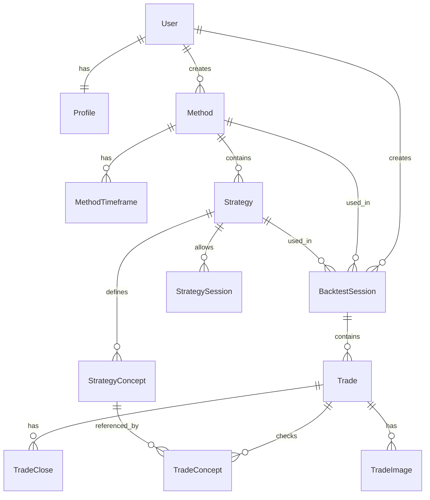

# PRD — Backend TradeLog

> **Dokumen**: PRD_Backend.md
> **Proyek**: TradeLog — Jurnal Backtest Trading Terpintar
> **Versi**: 1.0
> **Tanggal**: 26 Mei 2026
> **Status**: Draft
> **Dependensi**: [PRD_Frontend.md](./PRD_Frontend.md) · [PRD_LandingPage.md](./PRD_LandingPage.md)

---

## 1. Overview

Dokumen ini mendefinisikan seluruh backend services untuk TradeLog, mencakup database schema, Server Actions, API routes, business logic (R:R calculation), storage, keamanan (RLS), dan validasi data. Backend dibangun sepenuhnya di atas ekosistem **Supabase** dengan **Prisma ORM** sebagai abstraksi database, dan **Next.js Server Actions** sebagai transport layer utama.

---

## 2. Tech Stack

| Teknologi | Versi | Fungsi |
|-----------|-------|--------|
| Supabase | Latest | PostgreSQL database, Auth (email + OAuth), Storage (images) |
| Prisma ORM | 6.x | Database schema, migrations, type-safe queries |
| Next.js 15 | App Router | Server Actions, API Routes |
| TypeScript | 5.x | Type safety |
| Zod | 3.x | Input validation (shared dengan frontend) |
| bcrypt / Supabase Auth | — | Password hashing (handled by Supabase) |

---

## 3. Arsitektur Backend

```
┌─────────────────────────────────────────────────────────┐
│                     Next.js App                          │
│                                                          │
│  ┌──────────────────┐    ┌──────────────────────────┐   │
│  │  Server Actions   │    │  API Routes (/api/...)    │   │
│  │  (primary)        │    │  (OAuth callback, upload) │   │
│  └────────┬─────────┘    └────────────┬─────────────┘   │
│           │                            │                  │
│           ▼                            ▼                  │
│  ┌──────────────────────────────────────────────────┐    │
│  │              Zod Validation Layer                 │    │
│  └──────────────────────┬───────────────────────────┘    │
│                          │                                │
│           ┌──────────────┼──────────────┐                │
│           ▼              ▼              ▼                 │
│  ┌──────────────┐ ┌──────────┐ ┌────────────────┐       │
│  │  Prisma ORM   │ │ Supabase │ │   Supabase     │       │
│  │  (Database)   │ │  Auth    │ │   Storage      │       │
│  └──────┬───────┘ └────┬─────┘ └───────┬────────┘       │
│         │               │               │                 │
└─────────┼───────────────┼───────────────┼─────────────────┘
          ▼               ▼               ▼
   ┌──────────────────────────────────────────┐
   │         Supabase (PostgreSQL)             │
   │   + Auth Service + Storage Buckets        │
   └──────────────────────────────────────────┘
```

---

## 4. Database Schema

### 4.1 Diagram Entity Relationship (ERD)



### 4.2 Detail Tabel

#### `User`

> [!NOTE]
> Tabel `User` di Prisma di-sync dengan `auth.users` dari Supabase Auth. `id` menggunakan UUID yang sama dari Supabase Auth.

| Kolom | Tipe | Constraint | Deskripsi |
|-------|------|------------|-----------|
| `id` | `String` (UUID) | PK, dari Supabase Auth | ID unik user |
| `email` | `String` | Unique, Not Null | Email user |
| `username` | `String` | Unique, Not Null, 3-20 char | Username untuk URL publik |
| `createdAt` | `DateTime` | Not Null, default `now()` | Waktu registrasi |
| `updatedAt` | `DateTime` | Not Null, `@updatedAt` | Waktu terakhir diupdate |

```prisma
model User {
  id        String   @id @default(uuid()) @db.Uuid
  email     String   @unique
  username  String   @unique @db.VarChar(20)
  createdAt DateTime @default(now()) @map("created_at")
  updatedAt DateTime @updatedAt @map("updated_at")

  profile          Profile?
  methods          Method[]
  backtestSessions BacktestSession[]

  @@map("users")
}
```

#### `Profile`

| Kolom | Tipe | Constraint | Deskripsi |
|-------|------|------------|-----------|
| `id` | `String` (UUID) | PK | ID unik profil |
| `userId` | `String` (UUID) | FK → User.id, Unique | Relasi 1:1 ke User |
| `displayName` | `String?` | Optional, max 50 | Nama tampilan |
| `bio` | `String?` | Optional, max 300 | Bio singkat |
| `avatarUrl` | `String?` | Optional | URL avatar di Supabase Storage |

```prisma
model Profile {
  id          String  @id @default(uuid()) @db.Uuid
  userId      String  @unique @map("user_id") @db.Uuid
  displayName String? @map("display_name") @db.VarChar(50)
  bio         String? @db.VarChar(300)
  avatarUrl   String? @map("avatar_url")

  user User @relation(fields: [userId], references: [id], onDelete: Cascade)

  @@map("profiles")
}
```

#### `Method`

| Kolom | Tipe | Constraint | Deskripsi |
|-------|------|------------|-----------|
| `id` | `String` (UUID) | PK | ID unik method |
| `userId` | `String` (UUID) | FK → User.id | Pemilik method |
| `name` | `String` | Not Null, 3-100 char | Nama method (e.g., "SMC Swing") |
| `description` | `String?` | Optional, max 500 | Deskripsi method |
| `isPublic` | `Boolean` | Not Null, default `false` | Visibilitas publik |
| `tags` | `String[]` | Array of strings | Tags/labels |
| `createdAt` | `DateTime` | Not Null, default `now()` | Waktu dibuat |
| `updatedAt` | `DateTime` | Not Null, `@updatedAt` | Waktu diupdate |

```prisma
model Method {
  id          String   @id @default(uuid()) @db.Uuid
  userId      String   @map("user_id") @db.Uuid
  name        String   @db.VarChar(100)
  description String?  @db.VarChar(500)
  isPublic    Boolean  @default(false) @map("is_public")
  tags        String[] @default([])
  createdAt   DateTime @default(now()) @map("created_at")
  updatedAt   DateTime @updatedAt @map("updated_at")

  user             User              @relation(fields: [userId], references: [id], onDelete: Cascade)
  timeframes       MethodTimeframe[]
  strategies       Strategy[]
  backtestSessions BacktestSession[]

  @@index([userId])
  @@index([isPublic])
  @@map("methods")
}
```

#### `MethodTimeframe`

| Kolom | Tipe | Constraint | Deskripsi |
|-------|------|------------|-----------|
| `id` | `String` (UUID) | PK | ID unik |
| `methodId` | `String` (UUID) | FK → Method.id | Method pemilik |
| `timeframe` | `String` | Not Null | Timeframe (M1, M5, M15, M30, H1, H4, D1, W1, MN) |

```prisma
model MethodTimeframe {
  id         String @id @default(uuid()) @db.Uuid
  methodId   String @map("method_id") @db.Uuid
  timeframe  String @db.VarChar(10)

  method Method @relation(fields: [methodId], references: [id], onDelete: Cascade)

  @@unique([methodId, timeframe])
  @@map("method_timeframes")
}
```

#### `Strategy`

| Kolom | Tipe | Constraint | Deskripsi |
|-------|------|------------|-----------|
| `id` | `String` (UUID) | PK | ID unik strategy |
| `methodId` | `String` (UUID) | FK → Method.id | Method pemilik |
| `name` | `String` | Not Null, 3-100 char | Nama strategy |
| `triggerEntry` | `String` | Not Null, max 1000 | Deskripsi trigger entry |
| `slRule` | `String` | Not Null, max 500 | Aturan stop loss |
| `tpRule` | `String` | Not Null, max 500 | Aturan take profit |
| `createdAt` | `DateTime` | Not Null, default `now()` | Waktu dibuat |
| `updatedAt` | `DateTime` | Not Null, `@updatedAt` | Waktu diupdate |

```prisma
model Strategy {
  id           String   @id @default(uuid()) @db.Uuid
  methodId     String   @map("method_id") @db.Uuid
  name         String   @db.VarChar(100)
  triggerEntry String   @map("trigger_entry") @db.Text
  slRule       String   @map("sl_rule") @db.VarChar(500)
  tpRule       String   @map("tp_rule") @db.VarChar(500)
  createdAt    DateTime @default(now()) @map("created_at")
  updatedAt    DateTime @updatedAt @map("updated_at")

  method           Method             @relation(fields: [methodId], references: [id], onDelete: Cascade)
  concepts         StrategyConcept[]
  sessions         StrategySession[]
  backtestSessions BacktestSession[]

  @@index([methodId])
  @@map("strategies")
}
```

#### `StrategyConcept`

| Kolom | Tipe | Constraint | Deskripsi |
|-------|------|------------|-----------|
| `id` | `String` (UUID) | PK | ID unik |
| `strategyId` | `String` (UUID) | FK → Strategy.id | Strategy pemilik |
| `name` | `String` | Not Null, max 50 | Nama konsep (e.g., BOS, FVG, OB, Liquidity Sweep) |

```prisma
model StrategyConcept {
  id         String @id @default(uuid()) @db.Uuid
  strategyId String @map("strategy_id") @db.Uuid
  name       String @db.VarChar(50)

  strategy      Strategy       @relation(fields: [strategyId], references: [id], onDelete: Cascade)
  tradeConcepts TradeConcept[]

  @@unique([strategyId, name])
  @@map("strategy_concepts")
}
```

#### `StrategySession`

| Kolom | Tipe | Constraint | Deskripsi |
|-------|------|------------|-----------|
| `id` | `String` (UUID) | PK | ID unik |
| `strategyId` | `String` (UUID) | FK → Strategy.id | Strategy pemilik |
| `sessionName` | `Enum` | Not Null | ASIA, LONDON, NEW_YORK, LONDON_CLOSE |

```prisma
enum TradingSession {
  ASIA
  LONDON
  NEW_YORK
  LONDON_CLOSE
}

model StrategySession {
  id          String         @id @default(uuid()) @db.Uuid
  strategyId  String         @map("strategy_id") @db.Uuid
  sessionName TradingSession @map("session_name")

  strategy Strategy @relation(fields: [strategyId], references: [id], onDelete: Cascade)

  @@unique([strategyId, sessionName])
  @@map("strategy_sessions")
}
```

#### `BacktestSession`

| Kolom | Tipe | Constraint | Deskripsi |
|-------|------|------------|-----------|
| `id` | `String` (UUID) | PK | ID unik sesi |
| `userId` | `String` (UUID) | FK → User.id | Pemilik sesi |
| `methodId` | `String` (UUID) | FK → Method.id | Method yang digunakan |
| `strategyId` | `String` (UUID) | FK → Strategy.id | Strategy yang digunakan |
| `name` | `String` | Not Null, 3-100 char | Nama sesi |
| `instrument` | `String` | Not Null, max 20 | Instrument (e.g., XAUUSD) |
| `periodStart` | `DateTime` | Not Null | Awal periode backtest |
| `periodEnd` | `DateTime` | Not Null | Akhir periode backtest |
| `createdAt` | `DateTime` | Not Null, default `now()` | Waktu dibuat |
| `updatedAt` | `DateTime` | Not Null, `@updatedAt` | Waktu diupdate |

```prisma
model BacktestSession {
  id         String   @id @default(uuid()) @db.Uuid
  userId     String   @map("user_id") @db.Uuid
  methodId   String   @map("method_id") @db.Uuid
  strategyId String   @map("strategy_id") @db.Uuid
  name       String   @db.VarChar(100)
  instrument String   @db.VarChar(20)
  periodStart DateTime @map("period_start") @db.Date
  periodEnd   DateTime @map("period_end") @db.Date
  createdAt  DateTime @default(now()) @map("created_at")
  updatedAt  DateTime @updatedAt @map("updated_at")

  user     User     @relation(fields: [userId], references: [id], onDelete: Cascade)
  method   Method   @relation(fields: [methodId], references: [id], onDelete: Cascade)
  strategy Strategy @relation(fields: [strategyId], references: [id], onDelete: Cascade)
  trades   Trade[]

  @@index([userId])
  @@index([methodId])
  @@index([strategyId])
  @@map("backtest_sessions")
}
```

#### `Trade`

| Kolom | Tipe | Constraint | Deskripsi |
|-------|------|------------|-----------|
| `id` | `String` (UUID) | PK | ID unik trade |
| `sessionId` | `String` (UUID) | FK → BacktestSession.id | Sesi backtest |
| `tradeDate` | `DateTime` | Not Null | Tanggal trade |
| `session` | `Enum` | Not Null | Trading session (ASIA, LONDON, dll.) |
| `entryPrice` | `Decimal` | Not Null | Harga entry |
| `slPrice` | `Decimal` | Not Null | Harga stop loss |
| `tpPrice` | `Decimal` | Not Null | Harga take profit |
| `result` | `Enum` | Not Null | WIN, LOSS, BREAKEVEN, PARTIAL |
| `timeframeTrigger` | `String` | Not Null | Timeframe trigger |
| `notes` | `String?` | Optional, max 1000 | Catatan trade |
| `mood` | `Enum?` | Optional | DISCIPLINED, RUSHED, HESITANT |
| `riskPips` | `Decimal` | Not Null, calculated | \|entry - SL\| |
| `rewardPips` | `Decimal` | Not Null, calculated | \|TP - entry\| |
| `rrTarget` | `Decimal` | Not Null, calculated | reward / risk |
| `actualR` | `Decimal` | Not Null, calculated | Actual R berdasarkan close data |
| `createdAt` | `DateTime` | Not Null, default `now()` | Waktu dibuat |

```prisma
enum TradeResult {
  WIN
  LOSS
  BREAKEVEN
  PARTIAL
}

enum TradeMood {
  DISCIPLINED
  RUSHED
  HESITANT
}

model Trade {
  id               String         @id @default(uuid()) @db.Uuid
  sessionId        String         @map("session_id") @db.Uuid
  tradeDate        DateTime       @map("trade_date") @db.Date
  session          TradingSession
  entryPrice       Decimal        @map("entry_price") @db.Decimal(20, 5)
  slPrice          Decimal        @map("sl_price") @db.Decimal(20, 5)
  tpPrice          Decimal        @map("tp_price") @db.Decimal(20, 5)
  result           TradeResult
  timeframeTrigger String         @map("timeframe_trigger") @db.VarChar(10)
  notes            String?        @db.VarChar(1000)
  mood             TradeMood?
  riskPips         Decimal        @map("risk_pips") @db.Decimal(20, 5)
  rewardPips       Decimal        @map("reward_pips") @db.Decimal(20, 5)
  rrTarget         Decimal        @map("rr_target") @db.Decimal(10, 2)
  actualR          Decimal        @map("actual_r") @db.Decimal(10, 2)
  createdAt        DateTime       @default(now()) @map("created_at")

  backtestSession BacktestSession @relation(fields: [sessionId], references: [id], onDelete: Cascade)
  closes          TradeClose[]
  images          TradeImage[]
  concepts        TradeConcept[]

  @@index([sessionId])
  @@index([tradeDate])
  @@map("trades")
}
```

#### `TradeClose`

| Kolom | Tipe | Constraint | Deskripsi |
|-------|------|------------|-----------|
| `id` | `String` (UUID) | PK | ID unik |
| `tradeId` | `String` (UUID) | FK → Trade.id | Trade pemilik |
| `closePrice` | `Decimal` | Not Null | Harga close |
| `percentage` | `Decimal` | Not Null, 0-100 | Persentase posisi yang di-close |
| `notes` | `String?` | Optional | Catatan per close |

```prisma
model TradeClose {
  id         String  @id @default(uuid()) @db.Uuid
  tradeId    String  @map("trade_id") @db.Uuid
  closePrice Decimal @map("close_price") @db.Decimal(20, 5)
  percentage Decimal @db.Decimal(5, 2)
  notes      String? @db.VarChar(500)

  trade Trade @relation(fields: [tradeId], references: [id], onDelete: Cascade)

  @@index([tradeId])
  @@map("trade_closes")
}
```

#### `TradeImage`

| Kolom | Tipe | Constraint | Deskripsi |
|-------|------|------------|-----------|
| `id` | `String` (UUID) | PK | ID unik |
| `tradeId` | `String` (UUID) | FK → Trade.id | Trade pemilik |
| `imageType` | `Enum` | Not Null | BEFORE, AFTER |
| `storageUrl` | `String` | Not Null | URL di Supabase Storage |
| `uploadedAt` | `DateTime` | Not Null, default `now()` | Waktu upload |

```prisma
enum ImageType {
  BEFORE
  AFTER
}

model TradeImage {
  id         String    @id @default(uuid()) @db.Uuid
  tradeId    String    @map("trade_id") @db.Uuid
  imageType  ImageType @map("image_type")
  storageUrl String    @map("storage_url")
  uploadedAt DateTime  @default(now()) @map("uploaded_at")

  trade Trade @relation(fields: [tradeId], references: [id], onDelete: Cascade)

  @@unique([tradeId, imageType])
  @@index([tradeId])
  @@map("trade_images")
}
```

#### `TradeConcept`

| Kolom | Tipe | Constraint | Deskripsi |
|-------|------|------------|-----------|
| `id` | `String` (UUID) | PK | ID unik |
| `tradeId` | `String` (UUID) | FK → Trade.id | Trade pemilik |
| `strategyConceptId` | `String` (UUID) | FK → StrategyConcept.id | Konsep dari strategy |
| `isPresent` | `Boolean` | Not Null, default `false` | Apakah konsep hadir di trade ini |

```prisma
model TradeConcept {
  id                String  @id @default(uuid()) @db.Uuid
  tradeId           String  @map("trade_id") @db.Uuid
  strategyConceptId String  @map("strategy_concept_id") @db.Uuid
  isPresent         Boolean @default(false) @map("is_present")

  trade           Trade           @relation(fields: [tradeId], references: [id], onDelete: Cascade)
  strategyConcept StrategyConcept @relation(fields: [strategyConceptId], references: [id], onDelete: Cascade)

  @@unique([tradeId, strategyConceptId])
  @@index([tradeId])
  @@index([strategyConceptId])
  @@map("trade_concepts")
}
```

---

## 5. Relationships & Cascade Rules

| Parent | Child | Relasi | On Delete Parent |
|--------|-------|--------|------------------|
| `User` | `Profile` | 1:1 | Cascade |
| `User` | `Method` | 1:N | Cascade |
| `User` | `BacktestSession` | 1:N | Cascade |
| `Method` | `MethodTimeframe` | 1:N | Cascade |
| `Method` | `Strategy` | 1:N | Cascade |
| `Method` | `BacktestSession` | 1:N | Cascade |
| `Strategy` | `StrategyConcept` | 1:N | Cascade |
| `Strategy` | `StrategySession` | 1:N | Cascade |
| `Strategy` | `BacktestSession` | 1:N | Cascade |
| `BacktestSession` | `Trade` | 1:N | Cascade |
| `Trade` | `TradeClose` | 1:N | Cascade |
| `Trade` | `TradeImage` | 1:N | Cascade |
| `Trade` | `TradeConcept` | 1:N | Cascade |
| `StrategyConcept` | `TradeConcept` | 1:N | Cascade |

> [!WARNING]
> Cascade delete dari `User` akan menghapus **semua** data terkait: methods, strategies, sessions, trades, images, concepts. Pertimbangkan soft delete untuk v2.

---

## 6. Server Actions

### 6.1 Struktur File

```
lib/
├── actions/
│   ├── auth.ts
│   ├── method.ts
│   ├── strategy.ts
│   ├── session.ts
│   ├── trade.ts
│   ├── analytics.ts
│   ├── profile.ts
│   └── public.ts
├── validations/
│   ├── auth.ts
│   ├── method.ts
│   ├── strategy.ts
│   ├── session.ts
│   ├── trade.ts
│   └── profile.ts
├── db/
│   └── prisma.ts          ← Prisma client singleton
└── supabase/
    ├── client.ts          ← Supabase browser client
    ├── server.ts          ← Supabase server client
    └── middleware.ts       ← Auth middleware
```

### 6.2 Auth Actions — `lib/actions/auth.ts`

| Action | Input | Output | Deskripsi |
|--------|-------|--------|-----------|
| `register` | `{ email, password, username }` | `{ success, error? }` | Registrasi via Supabase Auth + insert User & Profile di DB |
| `login` | `{ email, password }` | `{ success, error? }` | Login via Supabase Auth |
| `logout` | — | `{ success }` | Logout, hapus session |
| `loginWithGitHub` | — | Redirect ke GitHub OAuth | Inisiasi OAuth flow |
| `getSession` | — | `{ user } \| null` | Ambil current user session |

**Flow Registrasi:**

```
1. Validasi input (Zod: email, password min 8, username 3-20 alphanumeric)
2. Supabase Auth: signUp(email, password)
3. Prisma: create User { id: supabaseUser.id, email, username }
4. Prisma: create Profile { userId: user.id }
5. Return success / error
```

**Flow OAuth:**

```
1. Redirect ke Supabase Auth: signInWithOAuth({ provider: 'github' })
2. GitHub redirects ke /api/auth/callback
3. Callback: exchange code → session
4. Check apakah User sudah ada di DB
   - Jika belum: create User (email dari GitHub, username dari GitHub handle)
   - Jika sudah: skip
5. Redirect ke /dashboard
```

### 6.3 Method Actions — `lib/actions/method.ts`

| Action | Input | Output | Deskripsi |
|--------|-------|--------|-----------|
| `createMethod` | `MethodInput` | `{ data: Method, error? }` | Buat method baru + timeframes |
| `updateMethod` | `{ id, ...MethodInput }` | `{ data: Method, error? }` | Update method + sync timeframes |
| `deleteMethod` | `{ id }` | `{ success, error? }` | Hapus method (cascade) |
| `getMethodsByUser` | — | `Method[]` | Ambil semua methods user (include counts) |
| `getMethodById` | `{ id }` | `Method \| null` | Ambil method detail (include strategies, timeframes) |
| `toggleVisibility` | `{ id }` | `{ data: Method, error? }` | Toggle `isPublic` |

**`createMethod` Implementation Detail:**

```typescript
'use server';

export async function createMethod(input: MethodInput) {
  // 1. Validate
  const parsed = methodSchema.safeParse(input);
  if (!parsed.success) return { error: parsed.error.flatten() };

  // 2. Auth check
  const session = await getSession();
  if (!session) return { error: 'Unauthorized' };

  // 3. Create with transaction
  const method = await prisma.method.create({
    data: {
      userId: session.user.id,
      name: parsed.data.name,
      description: parsed.data.description,
      isPublic: parsed.data.isPublic,
      tags: parsed.data.tags,
      timeframes: {
        create: parsed.data.timeframes.map(tf => ({ timeframe: tf })),
      },
    },
    include: { timeframes: true },
  });

  // 4. Revalidate
  revalidatePath('/methods');
  return { data: method };
}
```

### 6.4 Strategy Actions — `lib/actions/strategy.ts`

| Action | Input | Output | Deskripsi |
|--------|-------|--------|-----------|
| `createStrategy` | `StrategyInput` | `{ data: Strategy, error? }` | Buat strategy + concepts + sessions |
| `updateStrategy` | `{ id, ...StrategyInput }` | `{ data: Strategy, error? }` | Update strategy + sync concepts/sessions |
| `deleteStrategy` | `{ id }` | `{ success, error? }` | Hapus strategy (cascade) |
| `getStrategiesByMethod` | `{ methodId }` | `Strategy[]` | Ambil semua strategies dari method |

**`createStrategy` harus membuat:**
1. `Strategy` record
2. `StrategyConcept` records (dari array concepts)
3. `StrategySession` records (dari array sessions)

Gunakan Prisma `create` dengan nested `create`.

### 6.5 Session Actions — `lib/actions/session.ts`

| Action | Input | Output | Deskripsi |
|--------|-------|--------|-----------|
| `createSession` | `SessionInput` | `{ data: BacktestSession, error? }` | Buat backtest session |
| `updateSession` | `{ id, ...SessionInput }` | `{ data: BacktestSession, error? }` | Update session metadata |
| `deleteSession` | `{ id }` | `{ success, error? }` | Hapus session (cascade, termasuk semua trades) |
| `getSessionsByUser` | `{ filters? }` | `BacktestSession[]` | Ambil sessions user dengan filter opsional |
| `getSessionById` | `{ id }` | `BacktestSession \| null` | Ambil session detail + include trades count + stats |

**Filters untuk `getSessionsByUser`:**

```typescript
type SessionFilters = {
  methodId?: string;
  strategyId?: string;
  instrument?: string;
  dateFrom?: Date;
  dateTo?: Date;
};
```

### 6.6 Trade Actions — `lib/actions/trade.ts`

| Action | Input | Output | Deskripsi |
|--------|-------|--------|-----------|
| `createTrade` | `TradeInput` | `{ data: Trade, error? }` | Buat trade + auto-calculate R:R + create closes + create concepts |
| `updateTrade` | `{ id, ...TradeInput }` | `{ data: Trade, error? }` | Update trade + recalculate R:R |
| `deleteTrade` | `{ id }` | `{ success, error? }` | Hapus trade (cascade: closes, images, concepts) |
| `getTradesBySession` | `{ sessionId }` | `Trade[]` | Ambil semua trades dari session (include closes, images, concepts) |

**`createTrade` Implementation Detail:**

```typescript
'use server';

export async function createTrade(input: TradeInput) {
  // 1. Validate
  const parsed = tradeSchema.safeParse(input);
  if (!parsed.success) return { error: parsed.error.flatten() };

  // 2. Auth check + ownership check
  const session = await getSession();
  if (!session) return { error: 'Unauthorized' };

  // 3. Calculate R:R
  const { riskPips, rewardPips, rrTarget, actualR } = calculateRR(parsed.data);

  // 4. Create trade with nested relations
  const trade = await prisma.trade.create({
    data: {
      sessionId: parsed.data.sessionId,
      tradeDate: parsed.data.tradeDate,
      session: parsed.data.session,
      entryPrice: parsed.data.entryPrice,
      slPrice: parsed.data.slPrice,
      tpPrice: parsed.data.tpPrice,
      result: parsed.data.result,
      timeframeTrigger: parsed.data.timeframeTrigger,
      notes: parsed.data.notes,
      mood: parsed.data.mood,
      riskPips,
      rewardPips,
      rrTarget,
      actualR,
      closes: {
        create: parsed.data.closes.map(c => ({
          closePrice: c.closePrice,
          percentage: c.percentage,
          notes: c.notes,
        })),
      },
      concepts: {
        create: parsed.data.concepts.map(c => ({
          strategyConceptId: c.strategyConceptId,
          isPresent: c.isPresent,
        })),
      },
    },
    include: { closes: true, images: true, concepts: true },
  });

  // 5. Revalidate
  revalidatePath(`/sessions/${parsed.data.sessionId}`);
  return { data: trade };
}
```

### 6.7 Analytics Actions — `lib/actions/analytics.ts`

| Action | Input | Output | Deskripsi |
|--------|-------|--------|-----------|
| `getDashboardStats` | — | `DashboardStats` | Total trades, win rate, avg R, best strategy |
| `getEquityCurveData` | `{ filters? }` | `EquityPoint[]` | Data equity curve (cumulative R per trade) |
| `getConceptBreakdown` | `{ filters? }` | `ConceptStat[]` | Win rate & avg R per konsep |
| `getTimeframeBreakdown` | `{ filters? }` | `TimeframeStat[]` | Win rate & avg R per timeframe |
| `getSessionBreakdown` | `{ filters? }` | `SessionStat[]` | Win rate & avg R per trading session |
| `getRDistribution` | `{ filters? }` | `number[]` | Array of actual R values |
| `getMethodBreakdown` | — | `MethodStat[]` | Win rate & avg R per method |

**`DashboardStats` Type:**

```typescript
type DashboardStats = {
  totalTrades: number;
  winRate: number;         // Percentage (0-100)
  avgR: number;            // Average actual R
  bestStrategy: {
    name: string;
    winRate: number;
  } | null;
};
```

**`ConceptStat` Type:**

```typescript
type ConceptStat = {
  conceptId: string;
  conceptName: string;
  totalTrades: number;     // Trades where concept isPresent
  winCount: number;
  lossCount: number;
  winRate: number;
  avgR: number;
};
```

**Query untuk `getConceptBreakdown`:**

```sql
SELECT
  sc.id AS concept_id,
  sc.name AS concept_name,
  COUNT(t.id) AS total_trades,
  SUM(CASE WHEN t.result = 'WIN' THEN 1 ELSE 0 END) AS win_count,
  SUM(CASE WHEN t.result = 'LOSS' THEN 1 ELSE 0 END) AS loss_count,
  ROUND(
    SUM(CASE WHEN t.result = 'WIN' THEN 1 ELSE 0 END)::numeric
    / NULLIF(COUNT(t.id), 0) * 100,
    1
  ) AS win_rate,
  ROUND(AVG(t.actual_r)::numeric, 2) AS avg_r
FROM trade_concepts tc
JOIN strategy_concepts sc ON tc.strategy_concept_id = sc.id
JOIN trades t ON tc.trade_id = t.id
JOIN backtest_sessions bs ON t.session_id = bs.id
WHERE bs.user_id = $1
  AND tc.is_present = true
GROUP BY sc.id, sc.name
ORDER BY win_rate DESC;
```

### 6.8 Profile Actions — `lib/actions/profile.ts`

| Action | Input | Output | Deskripsi |
|--------|-------|--------|-----------|
| `updateProfile` | `ProfileInput` | `{ data: Profile, error? }` | Update display name, bio, avatar |
| `getPublicProfile` | `{ username }` | `PublicProfile \| null` | Ambil profil publik + published methods + aggregate stats |

### 6.9 Public Actions — `lib/actions/public.ts`

| Action | Input | Output | Deskripsi |
|--------|-------|--------|-----------|
| `getLeaderboard` | `{ sortBy?, instrument?, page? }` | `LeaderboardEntry[]` | Leaderboard dengan consistency score, min 30 trades |
| `getPublicMethods` | `{ search?, tags?, sortBy?, page? }` | `PublicMethod[]` | Methods publik dengan stats |
| `getPublicProfileByUsername` | `{ username }` | `PublicProfile \| null` | Profil publik |

**`getLeaderboard` Query:**

```sql
SELECT
  u.username,
  p.display_name,
  p.avatar_url,
  COUNT(t.id) AS total_trades,
  ROUND(
    SUM(CASE WHEN t.result IN ('WIN', 'PARTIAL') THEN 1 ELSE 0 END)::numeric
    / COUNT(t.id) * 100,
    1
  ) AS win_rate,
  ROUND(AVG(t.actual_r)::numeric, 2) AS avg_r,
  ROUND(
    (SUM(CASE WHEN t.result IN ('WIN', 'PARTIAL') THEN 1 ELSE 0 END)::numeric / COUNT(t.id))
    * LOG(COUNT(t.id))
    * AVG(t.actual_r)::numeric,
    4
  ) AS consistency_score
FROM trades t
JOIN backtest_sessions bs ON t.session_id = bs.id
JOIN users u ON bs.user_id = u.id
LEFT JOIN profiles p ON u.id = p.user_id
GROUP BY u.id, u.username, p.display_name, p.avatar_url
HAVING COUNT(t.id) >= 30
ORDER BY consistency_score DESC
LIMIT 20 OFFSET $1;
```

---

## 7. R:R Calculation Logic

### 7.1 Formula Dasar

```typescript
function calculateRR(trade: TradeInput): RRResult {
  const entryPrice = Number(trade.entryPrice);
  const slPrice = Number(trade.slPrice);
  const tpPrice = Number(trade.tpPrice);

  // Risk & Reward (dalam pips / price units)
  const riskPips = Math.abs(entryPrice - slPrice);
  const rewardPips = Math.abs(tpPrice - entryPrice);

  // Target R:R
  const rrTarget = riskPips > 0 ? rewardPips / riskPips : 0;

  // Actual R (berdasarkan close data)
  const actualR = calculateActualR(trade, riskPips);

  return {
    riskPips: round(riskPips, 5),
    rewardPips: round(rewardPips, 5),
    rrTarget: round(rrTarget, 2),
    actualR: round(actualR, 2),
  };
}
```

### 7.2 Actual R Calculation

```typescript
function calculateActualR(trade: TradeInput, riskPips: number): number {
  if (riskPips === 0) return 0;

  const entryPrice = Number(trade.entryPrice);

  switch (trade.result) {
    case 'WIN': {
      if (trade.closes.length === 0) {
        // Full TP hit → actual R = rrTarget
        return Math.abs(Number(trade.tpPrice) - entryPrice) / riskPips;
      }
      // Weighted average dari partial closes
      return calculateWeightedR(trade.closes, entryPrice, riskPips, 1);
    }

    case 'LOSS': {
      // Full SL hit → actual R = -1
      return -1;
    }

    case 'BREAKEVEN': {
      return 0;
    }

    case 'PARTIAL': {
      // Weighted average dari partial closes (bisa positif atau negatif)
      return calculateWeightedR(trade.closes, entryPrice, riskPips, 1);
    }

    default:
      return 0;
  }
}
```

### 7.3 Partial Close (Weighted R)

```typescript
function calculateWeightedR(
  closes: TradeClose[],
  entryPrice: number,
  riskPips: number,
  direction: 1 | -1 // 1 = long, -1 = short (inferred from entry vs SL)
): number {
  // Formula: Σ (percentage/100 × |closePrice - entryPrice| / riskPips)
  // Sign: positif jika close menguntungkan, negatif jika merugikan

  let weightedR = 0;

  for (const close of closes) {
    const closePrice = Number(close.closePrice);
    const percentage = Number(close.percentage) / 100;
    const priceDiff = closePrice - entryPrice;

    // R untuk close ini
    const closeR = priceDiff / riskPips * direction;

    weightedR += percentage * closeR;
  }

  return weightedR;
}
```

### 7.4 Contoh Kalkulasi

**Contoh 1: Full WIN (Long)**

```
Entry: 1.08500, SL: 1.08350, TP: 1.08950
Risk = |1.08500 - 1.08350| = 0.00150
Reward = |1.08950 - 1.08500| = 0.00450
R:R Target = 0.00450 / 0.00150 = 3.00
Actual R = +3.00 R
```

**Contoh 2: Partial Close**

```
Entry: 1.08500, SL: 1.08350, TP: 1.08950
Risk = 0.00150

Close #1: 1.08650 (50%) → R = (1.08650 - 1.08500) / 0.00150 = 1.00
Close #2: 1.08800 (50%) → R = (1.08800 - 1.08500) / 0.00150 = 2.00

Actual R = (0.50 × 1.00) + (0.50 × 2.00) = 0.50 + 1.00 = +1.50 R
```

**Contoh 3: LOSS**

```
Entry: 1.08500, SL: 1.08350
Hit SL → Actual R = -1.00 R
```

---

## 8. Supabase Storage

### 8.1 Konfigurasi Bucket

| Properti | Nilai |
|----------|-------|
| Bucket name | `trade-images` |
| Public | `false` (private bucket) |
| File size limit | 10MB |
| Allowed MIME types | `image/jpeg`, `image/png`, `image/webp` |

### 8.2 Path Convention

```
trade-images/
└── {userId}/
    └── {tradeId}/
        ├── before.{ext}
        └── after.{ext}
```

**Contoh:**
```
trade-images/
└── 550e8400-e29b-41d4-a716-446655440000/
    └── 6ba7b810-9dad-11d1-80b4-00c04fd430c8/
        ├── before.webp
        └── after.jpg
```

### 8.3 Storage Policies (RLS)

```sql
-- Policy: Users can upload to their own folder
CREATE POLICY "Users can upload own images"
ON storage.objects FOR INSERT
TO authenticated
WITH CHECK (
  bucket_id = 'trade-images'
  AND (storage.foldername(name))[1] = auth.uid()::text
);

-- Policy: Users can view their own images
CREATE POLICY "Users can view own images"
ON storage.objects FOR SELECT
TO authenticated
USING (
  bucket_id = 'trade-images'
  AND (storage.foldername(name))[1] = auth.uid()::text
);

-- Policy: Users can delete their own images
CREATE POLICY "Users can delete own images"
ON storage.objects FOR DELETE
TO authenticated
USING (
  bucket_id = 'trade-images'
  AND (storage.foldername(name))[1] = auth.uid()::text
);

-- Policy: Users can update their own images
CREATE POLICY "Users can update own images"
ON storage.objects FOR UPDATE
TO authenticated
USING (
  bucket_id = 'trade-images'
  AND (storage.foldername(name))[1] = auth.uid()::text
);
```

### 8.4 Upload Handler

```typescript
// API Route: POST /api/upload
export async function POST(request: Request) {
  // 1. Auth check
  const supabase = createServerClient();
  const { data: { user } } = await supabase.auth.getUser();
  if (!user) return NextResponse.json({ error: 'Unauthorized' }, { status: 401 });

  // 2. Parse form data
  const formData = await request.formData();
  const file = formData.get('file') as File;
  const tradeId = formData.get('tradeId') as string;
  const imageType = formData.get('imageType') as 'before' | 'after';

  // 3. Validate
  if (!file || !tradeId || !imageType) {
    return NextResponse.json({ error: 'Missing fields' }, { status: 400 });
  }
  if (file.size > 10 * 1024 * 1024) {
    return NextResponse.json({ error: 'File too large (max 10MB)' }, { status: 400 });
  }

  // 4. Upload to Supabase Storage
  const ext = file.name.split('.').pop();
  const path = `${user.id}/${tradeId}/${imageType}.${ext}`;

  const { data, error } = await supabase.storage
    .from('trade-images')
    .upload(path, file, { upsert: true });

  if (error) {
    return NextResponse.json({ error: error.message }, { status: 500 });
  }

  // 5. Get signed URL
  const { data: urlData } = await supabase.storage
    .from('trade-images')
    .createSignedUrl(path, 60 * 60 * 24 * 365); // 1 year

  // 6. Save to DB
  await prisma.tradeImage.upsert({
    where: { tradeId_imageType: { tradeId, imageType: imageType.toUpperCase() as ImageType } },
    create: { tradeId, imageType: imageType.toUpperCase() as ImageType, storageUrl: urlData!.signedUrl },
    update: { storageUrl: urlData!.signedUrl },
  });

  return NextResponse.json({ url: urlData!.signedUrl });
}
```

---

## 9. Row Level Security (RLS) Policies

### 9.1 Kebijakan Umum

| Aturan | Deskripsi |
|--------|-----------|
| Default deny | Semua tabel: deny all tanpa policy |
| Owner CRUD | User hanya bisa CRUD data miliknya sendiri |
| Public read | Data `isPublic = true` bisa dibaca tanpa auth |
| Aggregate read | Leaderboard data (aggregasi) bisa dibaca tanpa auth |

### 9.2 Policies Per Tabel

#### `users`

```sql
-- Users can read their own data
CREATE POLICY "Users can read own data" ON users
  FOR SELECT USING (id = auth.uid());

-- Users can update their own data
CREATE POLICY "Users can update own data" ON users
  FOR UPDATE USING (id = auth.uid());
```

#### `profiles`

```sql
-- Users can read their own profile
CREATE POLICY "Users can read own profile" ON profiles
  FOR SELECT USING (user_id = auth.uid());

-- Users can update their own profile
CREATE POLICY "Users can update own profile" ON profiles
  FOR UPDATE USING (user_id = auth.uid());

-- Public profiles are readable (for /u/[username] and leaderboard)
CREATE POLICY "Public profiles readable" ON profiles
  FOR SELECT USING (true);
  -- Note: profile data is minimal, safe to expose
```

#### `methods`

```sql
-- Users can CRUD their own methods
CREATE POLICY "Users can manage own methods" ON methods
  FOR ALL USING (user_id = auth.uid());

-- Public methods are readable by anyone
CREATE POLICY "Public methods readable" ON methods
  FOR SELECT USING (is_public = true);
```

#### `strategies` (via method ownership)

```sql
-- Users can manage strategies of their own methods
CREATE POLICY "Users can manage own strategies" ON strategies
  FOR ALL USING (
    method_id IN (SELECT id FROM methods WHERE user_id = auth.uid())
  );

-- Strategies of public methods are readable
CREATE POLICY "Public strategies readable" ON strategies
  FOR SELECT USING (
    method_id IN (SELECT id FROM methods WHERE is_public = true)
  );
```

#### `backtest_sessions`

```sql
-- Users can manage their own sessions
CREATE POLICY "Users can manage own sessions" ON backtest_sessions
  FOR ALL USING (user_id = auth.uid());
```

#### `trades`

```sql
-- Users can manage trades in their own sessions
CREATE POLICY "Users can manage own trades" ON trades
  FOR ALL USING (
    session_id IN (SELECT id FROM backtest_sessions WHERE user_id = auth.uid())
  );
```

#### `trade_images`

```sql
-- Users can manage images of their own trades
CREATE POLICY "Users can manage own trade images" ON trade_images
  FOR ALL USING (
    trade_id IN (
      SELECT t.id FROM trades t
      JOIN backtest_sessions bs ON t.session_id = bs.id
      WHERE bs.user_id = auth.uid()
    )
  );
```

#### `trade_concepts`

```sql
-- Users can manage concepts of their own trades
CREATE POLICY "Users can manage own trade concepts" ON trade_concepts
  FOR ALL USING (
    trade_id IN (
      SELECT t.id FROM trades t
      JOIN backtest_sessions bs ON t.session_id = bs.id
      WHERE bs.user_id = auth.uid()
    )
  );
```

> [!IMPORTANT]
> Karena menggunakan Prisma ORM (yang connect langsung ke PostgreSQL), RLS hanya berlaku jika Prisma menggunakan koneksi **sebagai user Supabase** (bukan service role). Pastikan connection string menggunakan `pgbouncer` mode dan session-level auth, ATAU handle authorization di application layer (Server Actions) sebagai lapisan keamanan utama.

---

## 10. Validation (Zod Schemas)

### 10.1 Auth

```typescript
// lib/validations/auth.ts
import { z } from 'zod';

export const loginSchema = z.object({
  email: z.string().email('Email tidak valid'),
  password: z.string().min(8, 'Password minimal 8 karakter'),
});

export const registerSchema = z.object({
  email: z.string().email('Email tidak valid'),
  password: z
    .string()
    .min(8, 'Password minimal 8 karakter')
    .regex(/[a-zA-Z]/, 'Password harus mengandung huruf')
    .regex(/[0-9]/, 'Password harus mengandung angka'),
  username: z
    .string()
    .min(3, 'Username minimal 3 karakter')
    .max(20, 'Username maksimal 20 karakter')
    .regex(/^[a-zA-Z0-9_]+$/, 'Username hanya boleh huruf, angka, dan underscore'),
});

export type LoginInput = z.infer<typeof loginSchema>;
export type RegisterInput = z.infer<typeof registerSchema>;
```

### 10.2 Method

```typescript
// lib/validations/method.ts
import { z } from 'zod';

export const methodSchema = z.object({
  name: z.string().min(3, 'Nama minimal 3 karakter').max(100, 'Nama maksimal 100 karakter'),
  description: z.string().max(500, 'Deskripsi maksimal 500 karakter').optional(),
  isPublic: z.boolean().default(false),
  tags: z.array(z.string().max(30)).max(10, 'Maksimal 10 tags').default([]),
  timeframes: z
    .array(z.enum(['M1', 'M5', 'M15', 'M30', 'H1', 'H4', 'D1', 'W1', 'MN']))
    .min(1, 'Pilih minimal 1 timeframe'),
});

export type MethodInput = z.infer<typeof methodSchema>;
```

### 10.3 Strategy

```typescript
// lib/validations/strategy.ts
import { z } from 'zod';

export const strategySchema = z.object({
  methodId: z.string().uuid(),
  name: z.string().min(3).max(100),
  triggerEntry: z.string().min(1, 'Trigger entry wajib diisi').max(1000),
  slRule: z.string().min(1, 'SL rule wajib diisi').max(500),
  tpRule: z.string().min(1, 'TP rule wajib diisi').max(500),
  concepts: z
    .array(z.object({ name: z.string().min(1).max(50) }))
    .min(1, 'Minimal 1 konsep'),
  sessions: z
    .array(z.enum(['ASIA', 'LONDON', 'NEW_YORK', 'LONDON_CLOSE']))
    .min(1, 'Pilih minimal 1 session'),
});

export type StrategyInput = z.infer<typeof strategySchema>;
```

### 10.4 Session

```typescript
// lib/validations/session.ts
import { z } from 'zod';

export const sessionSchema = z.object({
  name: z.string().min(3).max(100),
  methodId: z.string().uuid('Pilih method'),
  strategyId: z.string().uuid('Pilih strategy'),
  instrument: z.string().min(1, 'Instrument wajib diisi').max(20),
  periodStart: z.coerce.date(),
  periodEnd: z.coerce.date(),
}).refine(data => data.periodEnd >= data.periodStart, {
  message: 'Akhir periode harus setelah atau sama dengan awal periode',
  path: ['periodEnd'],
});

export type SessionInput = z.infer<typeof sessionSchema>;
```

### 10.5 Trade

```typescript
// lib/validations/trade.ts
import { z } from 'zod';

const tradeCloseSchema = z.object({
  closePrice: z.coerce.number().positive('Harga close harus positif'),
  percentage: z.coerce.number().min(0).max(100),
  notes: z.string().max(500).optional(),
});

const tradeConceptSchema = z.object({
  strategyConceptId: z.string().uuid(),
  isPresent: z.boolean(),
});

export const tradeSchema = z.object({
  sessionId: z.string().uuid(),
  tradeDate: z.coerce.date(),
  session: z.enum(['ASIA', 'LONDON', 'NEW_YORK', 'LONDON_CLOSE']),
  entryPrice: z.coerce.number().positive('Entry price harus positif'),
  slPrice: z.coerce.number().positive('SL price harus positif'),
  tpPrice: z.coerce.number().positive('TP price harus positif'),
  result: z.enum(['WIN', 'LOSS', 'BREAKEVEN', 'PARTIAL']),
  timeframeTrigger: z.string().min(1),
  notes: z.string().max(1000).optional(),
  mood: z.enum(['DISCIPLINED', 'RUSHED', 'HESITANT']).optional(),
  closes: z.array(tradeCloseSchema).default([]),
  concepts: z.array(tradeConceptSchema).default([]),
}).refine(data => {
  // Validasi: entry != SL
  return data.entryPrice !== data.slPrice;
}, {
  message: 'Entry price tidak boleh sama dengan SL price',
  path: ['slPrice'],
}).refine(data => {
  // Validasi: jika PARTIAL, total percentage harus = 100
  if (data.result === 'PARTIAL' && data.closes.length > 0) {
    const total = data.closes.reduce((sum, c) => sum + c.percentage, 0);
    return Math.abs(total - 100) < 0.01;
  }
  return true;
}, {
  message: 'Total persentase close harus = 100%',
  path: ['closes'],
});

export type TradeInput = z.infer<typeof tradeSchema>;
```

### 10.6 Profile

```typescript
// lib/validations/profile.ts
import { z } from 'zod';

export const profileSchema = z.object({
  displayName: z.string().max(50).optional(),
  bio: z.string().max(300).optional(),
  avatarUrl: z.string().url().optional(),
});

export type ProfileInput = z.infer<typeof profileSchema>;
```

---

## 11. Consistency Score

### 11.1 Formula

```
consistencyScore = winRate × log₁₀(totalTrades) × avgR
```

| Variabel | Definisi |
|----------|----------|
| `winRate` | Rasio trade WIN + PARTIAL terhadap total trades (0-1, bukan persen) |
| `totalTrades` | Jumlah total trades user |
| `avgR` | Rata-rata `actualR` dari seluruh trades |

### 11.2 Syarat

- Minimum **30 trades** untuk masuk leaderboard
- `log₁₀(30) ≈ 1.477` — memberikan bobot terhadap volume trading
- Score bisa negatif jika `avgR` negatif

### 11.3 Contoh

| Trader | Win Rate | Total Trades | Avg R | Score |
|--------|----------|--------------|-------|-------|
| A | 0.65 | 100 | 1.80 | 0.65 × 2.0 × 1.80 = **2.340** |
| B | 0.75 | 50 | 1.20 | 0.75 × 1.699 × 1.20 = **1.529** |
| C | 0.55 | 200 | 2.50 | 0.55 × 2.301 × 2.50 = **3.164** |
| D | 0.80 | 31 | 0.80 | 0.80 × 1.491 × 0.80 = **0.954** |

> [!TIP]
> Score menghargai **konsistensi** (win rate tinggi), **volume** (banyak trades), dan **kualitas** (avg R tinggi) secara bersamaan. Trader C menang meskipun win rate tidak tertinggi karena volume dan kualitas superior.

---

## 12. API Routes

### 12.1 `POST /api/auth/callback`

**Fungsi**: Handle OAuth callback dari GitHub.

```typescript
// app/api/auth/callback/route.ts
import { createServerClient } from '@/lib/supabase/server';
import { NextResponse } from 'next/server';

export async function GET(request: Request) {
  const requestUrl = new URL(request.url);
  const code = requestUrl.searchParams.get('code');

  if (code) {
    const supabase = createServerClient();
    const { data, error } = await supabase.auth.exchangeCodeForSession(code);

    if (!error && data.user) {
      // Check/create user in our DB
      const existingUser = await prisma.user.findUnique({
        where: { id: data.user.id },
      });

      if (!existingUser) {
        await prisma.user.create({
          data: {
            id: data.user.id,
            email: data.user.email!,
            username: data.user.user_metadata.user_name || data.user.id.slice(0, 8),
            profile: { create: {} },
          },
        });
      }
    }
  }

  return NextResponse.redirect(new URL('/dashboard', requestUrl.origin));
}
```

### 12.2 `POST /api/upload`

Lihat [Section 8.4 — Upload Handler](#84-upload-handler) untuk implementasi lengkap.

---

## 13. Middleware (Auth Protection)

```typescript
// middleware.ts
import { createMiddlewareClient } from '@/lib/supabase/middleware';
import { NextResponse } from 'next/server';
import type { NextRequest } from 'next/server';

export async function middleware(request: NextRequest) {
  const { supabase, response } = createMiddlewareClient(request);
  const { data: { session } } = await supabase.auth.getSession();

  const protectedPaths = ['/dashboard', '/methods', '/sessions', '/analytics', '/profile'];
  const authPaths = ['/login', '/register'];
  const pathname = request.nextUrl.pathname;

  // Redirect authenticated users away from auth pages
  if (session && authPaths.some(p => pathname.startsWith(p))) {
    return NextResponse.redirect(new URL('/dashboard', request.url));
  }

  // Redirect unauthenticated users to login
  if (!session && protectedPaths.some(p => pathname.startsWith(p))) {
    return NextResponse.redirect(new URL('/login', request.url));
  }

  return response;
}

export const config = {
  matcher: [
    '/dashboard/:path*',
    '/methods/:path*',
    '/sessions/:path*',
    '/analytics/:path*',
    '/profile/:path*',
    '/login',
    '/register',
  ],
};
```

---

## 14. Error Handling

### 14.1 Server Action Error Pattern

```typescript
type ActionResult<T> = {
  data?: T;
  error?: string | Record<string, string[]>;
};

// Usage in Server Action
export async function createMethod(input: MethodInput): Promise<ActionResult<Method>> {
  try {
    const parsed = methodSchema.safeParse(input);
    if (!parsed.success) {
      return { error: parsed.error.flatten().fieldErrors };
    }

    const session = await getSession();
    if (!session) {
      return { error: 'Anda harus login untuk melakukan ini' };
    }

    const method = await prisma.method.create({ ... });
    revalidatePath('/methods');
    return { data: method };

  } catch (error) {
    console.error('createMethod error:', error);
    return { error: 'Terjadi kesalahan server. Silakan coba lagi.' };
  }
}
```

### 14.2 Error Messages (Bahasa Indonesia)

| Kode | Pesan |
|------|-------|
| `UNAUTHORIZED` | "Anda harus login untuk melakukan ini" |
| `FORBIDDEN` | "Anda tidak memiliki akses ke data ini" |
| `NOT_FOUND` | "Data tidak ditemukan" |
| `VALIDATION` | Field-specific dari Zod (lihat schemas) |
| `DUPLICATE_USERNAME` | "Username sudah digunakan" |
| `DUPLICATE_EMAIL` | "Email sudah terdaftar" |
| `SERVER_ERROR` | "Terjadi kesalahan server. Silakan coba lagi." |
| `UPLOAD_TOO_LARGE` | "File terlalu besar (maksimal 10MB)" |
| `UPLOAD_INVALID_TYPE` | "Format file tidak didukung. Gunakan JPG, PNG, atau WEBP" |

---

## 15. Acceptance Criteria

| # | Kriteria | Prioritas |
|---|----------|-----------|
| 1 | Auth flow (register, login, logout, GitHub OAuth) berfungsi end-to-end | P0 |
| 2 | CRUD Method + Timeframes berfungsi | P0 |
| 3 | CRUD Strategy + Concepts + Sessions berfungsi | P0 |
| 4 | CRUD BacktestSession berfungsi | P0 |
| 5 | CRUD Trade + auto-calculate R:R berfungsi | P0 |
| 6 | Partial close R:R calculation akurat | P0 |
| 7 | Image upload ke Supabase Storage berfungsi | P0 |
| 8 | RLS / authorization: user hanya bisa akses data sendiri | P0 |
| 9 | Dashboard analytics menampilkan data yang benar | P0 |
| 10 | Concept breakdown akurat | P0 |
| 11 | Leaderboard dengan consistency score berfungsi | P0 |
| 12 | Public methods library berfungsi | P0 |
| 13 | Public profile berfungsi | P0 |
| 14 | Cascade delete berfungsi (hapus method → hapus semua children) | P0 |
| 15 | Validasi Zod menolak input invalid | P0 |
| 16 | Error messages dalam Bahasa Indonesia | P1 |
| 17 | Middleware auth protection berfungsi | P0 |

---

## 16. Verification & Testing

### 16.1 Unit Testing

- [ ] R:R calculation: test semua skenario (WIN, LOSS, BE, PARTIAL, multiple closes)
- [ ] Zod schemas: test valid & invalid inputs untuk setiap schema
- [ ] Consistency score: test formula dengan berbagai input

### 16.2 Integration Testing

- [ ] Auth flow: register → login → session valid → logout → session invalid
- [ ] CRUD lifecycle: create → read → update → delete untuk setiap entity
- [ ] Cascade delete: hapus User → verifikasi semua children terhapus
- [ ] Image upload: upload → save URL → retrieve → delete
- [ ] OAuth flow: GitHub redirect → callback → user created → dashboard

### 16.3 Security Testing

- [ ] Authorization: user A tidak bisa akses data user B
- [ ] RLS policies: direct DB query tidak bisa bypass authorization
- [ ] Image access: user A tidak bisa akses gambar user B
- [ ] Middleware: unauthenticated request ke protected routes → redirect ke login
- [ ] Input validation: SQL injection, XSS via notes/description fields

### 16.4 Performance Testing

- [ ] Analytics queries: response time < 500ms untuk 1000 trades
- [ ] Leaderboard query: response time < 1s untuk 1000 users
- [ ] Image upload: < 3s untuk 10MB file (termasuk compression)
- [ ] Database indexes: verify semua foreign keys dan frequently queried columns ter-index

### 16.5 Data Integrity Testing

- [ ] R:R calculation accuracy: compare manual calculation vs auto-calculation untuk 50+ skenario
- [ ] Partial close: total percentage validation (harus = 100%)
- [ ] Unique constraints: duplicate username, duplicate email, duplicate concept name per strategy
- [ ] Foreign key constraints: referential integrity terjaga

---

## 17. Referensi ke PRD Lain

| PRD | Relasi |
|-----|--------|
| [PRD_Frontend.md](./PRD_Frontend.md) | Frontend mengkonsumsi semua Server Actions dan API Routes yang didefinisikan di sini. Zod schemas di-share. Form handling bergantung pada validation schemas. |
| [PRD_LandingPage.md](./PRD_LandingPage.md) | Stats section di landing page akan memanggil public aggregation endpoint (total trades, methods, users) dari backend ini. |

---

## 18. Out of Scope (v1)

- Soft delete (semua delete adalah hard delete di v1)
- Rate limiting pada API routes (pertimbangkan untuk v2)
- Webhook / event-driven architecture
- Background jobs (e.g., recalculate analytics)
- Data export (CSV, PDF)
- Audit log
- Multi-tenancy
- Caching layer (Redis) — gunakan Next.js built-in caching
- Database connection pooling (selain Supabase pgbouncer)
